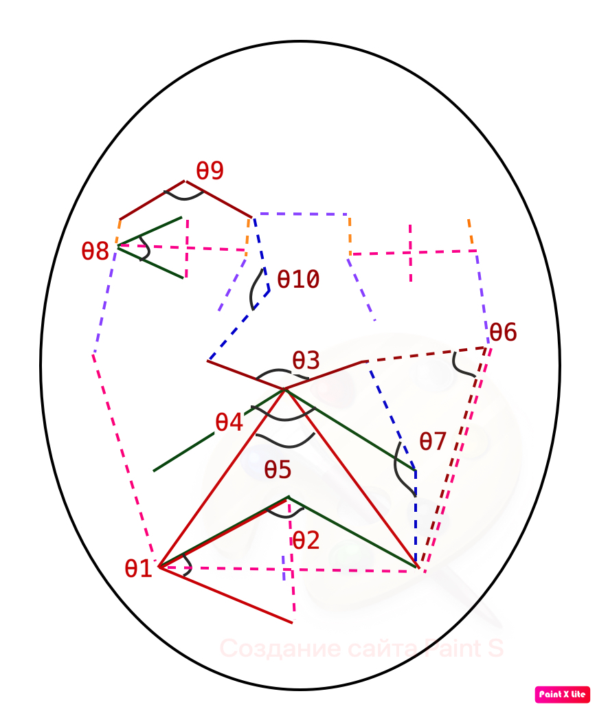

# I.G.O.R.
Imperfect but Glorious Oppressive Robot

Система удаленного констроля и анализа поведения сотрудника на рабочем месте. Включает детекцию сна, детекцию эмоций, инструменты обратной связи, сбора статистики и визуализации.
Это проект [@ShakalTabaqui](https://github.com/ShakalTabaqui), [@VAapero1](https://github.com/VAapero1), [@OlgaKrylova](https://github.com/OlgaKrylova), [@datascientist73](https://github.com/datascientist73) в [Elbrus coding bootcamp](https://github.com/Elbrus-DataScience). Видеодемонстрация лежит [тут](images/mmm.mp4).

Мы использовали библиотеку <a href="https://google.github.io/mediapipe/">MediaPipe</a> для детекции лица, позы человека и получения координат точек на лице и теле. На основе информациии о точках мы считали расстояния и углы на лице и теле для обучения классификаторов.
Классификаторов всего три:спящего лица, спящей позы и эмоций. Все они работают на <a href="https://catboost.ai/en/docs/">CatBoost</a>.
Классификатор спящей позы сам по себе не очень информативен: MediaPipe при построении сетки позы определяет только середину глаза одной точкой, поэтому непонятно открыты глаза или нет. Мы использовали его в случаях, когда человек находится в сложной позе и MediaPipe не строит сетку по лицу. Кроме того, мы дополнили его детектором статичности позы (что-то вроде MSE в течение определенного времени). Теперь если человек в странной позе и долго не шевелится - I.G.O.R. считает что он спит. 
 
Слева - точки которые мы получаем после детекции Mediapipe, на двух других картинках - расстояния и углы, которые мы использовали для классификации эмоций:

Для детекции сна по лицу использовали длину и высоту обоих глаз а также также разницу координат между глазами, щеками и губами. 
Для детекции сна по позе использовали расстояния от плеч до глаз, губ и щек, и покоординатные разницы между частью этих точек. Расстояния нормированы на размеры лица. Схема для лица лежит в папке images.
Часть идей по отбору точек для классификации <a href="https://www.ncbi.nlm.nih.gov/pmc/articles/PMC8828335">взята отсюда. </a>
Вот немного картинок, которые мы получали в процессе обучения моделей: 

Музыку для будильника генерировали с помощью нейросети <a href="https://openai.com/blog/jukebox/">Jukebox от OpenAI</a>, куда на вход в качестве праймера подавалась запись акустической гитары, а на выходе мы получали полноценный трек.
Выбор пал на Lo-Fi звучание по тем причинам, что исследования нейроанатомов в области сна говорят, что человеку желательно просыпаться под спокойное музыкальное сопровождение, в котором присутствуют низкочастотные звуки, т.к они правильно воздействуют на ЦНС при пробуждении.

<h1>Инструкция по запуску</h1>
1.  Запустить терминал и прописать команду
  
    pip install -r 'requirements.txt'
    
  *Эта команда установит нужные для работы библиотеки*

<h1> </h1>
2.  Открыть файл Streamlit.py, в терминале прописать команду
  
    streamlit run streamlit.py

  *Эта команда запустит приложение*
  
<h2>Описание дополнительных файлов</h2>

- emotions_classifier.ipynb - обучение классификатора эмоций

- camera_emotions.py - запускается также через терминал; в реальном времени строит на лице сетку и классифицирует эмоции (как на изображениях выше)
    
<h1>TODO</h1>

- обучение классификатора сна

- изменить цифры в статистике

- несколько лиц
